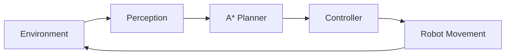

# 🤖 NaviAI Pro: AI-Based Autonomous Navigation System

[](https://opensource.org/licenses/MIT)
[](https://www.python.org/downloads/)
[](https://react.dev/)
[](https://tailwindcss.com/)

An industry-grade autonomous navigation simulation designed to showcase the **Sense-Plan-Act** cycle in robotics. This project implements a robust pathfinding engine using the **A* Search Algorithm** and provides an interactive dashboard for real-time performance monitoring.

---

## 🌟 Project Highlights

- **Interactive Simulation**: Real-time grid-based navigation with dynamic obstacle placement.
- **Advanced Pathfinding**: High-performance A* implementation with Manhattan distance heuristics.
- **Analytics Dashboard**: Live visualization of compute latency, path efficiency, and environment density.
- **Modular Architecture**: Decoupled Perception, Planning, and Control layers.
- **Developer-First Documentation**: Comprehensive guide for local setup and algorithm extension.

---

## 🏗️ System Architecture

The NaviAI Pro system is built on a modular robotics pipeline:

1.  **Perception Layer**: Scans the environment to identify collision nodes and safety constraints.
2.  **Planning Engine**: Evaluates the cost of potential paths using the A* algorithm to find the global optimum.
3.  **Control Module**: Executes the trajectory step-by-step, ensuring smooth movement and collision avoidance.



---

## 🛠️ Tech Stack

| Category | Technology |
| :--- | :--- |
| **Frontend** | React 19, TypeScript, Tailwind CSS |
| **Animation** | Motion (formerly Framer Motion) |
| **Visualization** | Recharts, HTML5 Canvas API |
| **Algorithms** | A* Search (Custom Implementation) |
| **Icons** | Lucide React |

---

## 🚀 Getting Started

### Prerequisites
- Node.js 18+
- npm or yarn

### Installation
1. Clone the repository:
   ```bash
   git clone https://github.com/your-username/naviai-pro.git
   ```
2. Navigate to the project directory:
   ```bash
   cd naviai-pro
   ```
3. Install dependencies:
   ```bash
   npm install
   ```
4. Start the development server:
   ```bash
   npm run dev
   ```

---

## 📊 Simulation Workflow

1. **Initialize**: The system generates a random environment with obstacles.
2. **Set Goal**: The green node represents the target destination.
3. **Navigate**: Click "Start Mission" to watch the robot (red node) find and follow the path.
4. **Interact**: Click any grid cell to toggle obstacles. The system will re-plan the path instantly if the environment changes.

---

## 📈 Results & Analytics

The dashboard provides real-time insights into the navigation performance:
- **Compute Latency**: Measured in milliseconds, showing the efficiency of the A* engine.
- **Path Steps**: The total number of nodes in the calculated trajectory.
- **Obstacle Density**: The percentage of the grid occupied by obstacles, indicating environment complexity.

---

## 🔮 Future Improvements

- [ ] **SLAM Integration**: Implement Simultaneous Localization and Mapping.
- [ ] **3D Visualization**: Upgrade the simulation to a 3D environment using Three.js.
- [ ] **Multi-Agent Support**: Coordinate multiple robots in the same environment.
- [ ] **Reinforcement Learning**: Train agents to navigate using Deep Q-Learning.

---

## 🎓 Learning Outcomes

This project demonstrates proficiency in:
- **Robotics Fundamentals**: Understanding the Sense-Plan-Act paradigm.
- **Algorithm Design**: Implementing and optimizing search algorithms.
- **Full-Stack Engineering**: Building complex, state-driven interactive UIs.
- **Data Visualization**: Translating raw algorithm metrics into actionable insights.

---

## 👤 Author

**Jidnyasa Patil**
- GitHub: [@Jidnyasa-P](https://github.com/Jidnyasa-P)
- LinkedIn: [Your Profile](https://www.linkedin.com/in/jidnyasa-patil-02a668344)

---

*This project was built as part of a professional portfolio to demonstrate expertise in AI and Robotics Engineering.*
